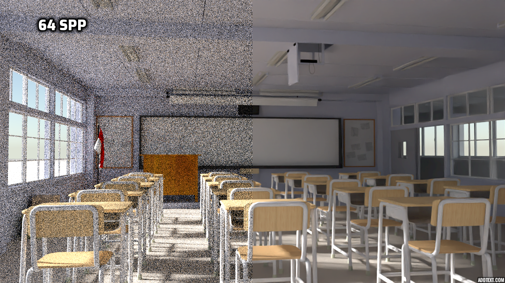
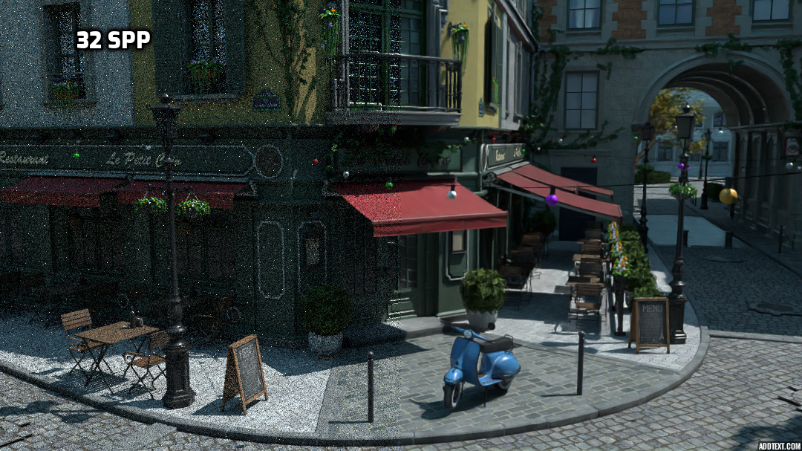

# Yocto AI Denoising
The main purpose of this project is to integrate and test the [Intel Open Image Denoiser](https://openimagedenoise.github.io) in Yocto. The `yimgdenoise.cpp` app uses the denoiser API to filter noisy images obtained through MC rendering. The parameters that can be passed from the command line to this app are:

- **--input-image**   input noisy image filename
- **--output-image**  output image filename
- **--normal**  normal image filename
- **--albedo**  albedo image filename 
- **--maxMemoryMB** approximate maximum amount of scratch memory to use in megabytes
- **--numThreads** maximum number of threads that can be used by the device
- **--verbose** device verbosity level
- **--setAffinity** bind software threads to hardware threads if set to true (improves performance); false disables binding

The results obtained with the intel denoiser are very convincing and show that this denoiser works well even with images generated using few ssp. The following images are some examples

## Framework

If you still need details, see the descriptions on previous homeworks.

## Functionality

Pick one of the projects below.

### Algorithmic Projects

- **Hair Shading (1-2 people, medium)**:
    - implement a hair BSDF to shade realistic-looking hairs
    - you can follow the algorithm presented in [pbrt](https://www.pbrt.org/hair.pdf)
      that also includes a full code implementation
    - you can get example hair models from [Bitterli](https://benedikt-bitterli.me/resources/)
- **AI Denoising (1 person, easy)**:
    - integrate the [Intel Open Image Denoise](https://openimagedenoise.github.io)
    - modify the renderer to output what is needed for the denoiser
    - write a new app `yimagedenoise` that takes the new images in and output the denoised ones
    - favor HDR image processing but support both HDR and LDR
    - compare this to your own implementation of an non-local-means denoiser; 
      you can grab the code from anywhere you want
- **Bayesian Denoising (2 people, easy)**:
    - integrate the [Bayesian Collaborative Denoising](https://github.com/superboubek/bcd)
    - modify the renderer to output what is needed for the denoiser
    - write a new app `yimagedenoise` that takes the new images in and output the denoised ones
    - favor HDR image processing but support both HDR and LDR
    - compare this to your own implementation of an non-local-means denoiser; 
      you can grab the code from anywhere you want
- **Monte Carlo Geometry Processing (1-2 people, medium)**:
    - this is really beautiful new work
    - implement a few geometry processing functions using Monte Carlo methods
    - you should be familiar with geometry processing ideas already
    - take any examples from [Crane](http://www.cs.cmu.edu/~kmcrane/Projects/MonteCarloGeometryProcessing/paper.pdf)
    - example code in 2D from [here](http://www.cs.cmu.edu/~kmcrane/Projects/MonteCarloGeometryProcessing/WoSLaplace2D.cpp.html)
    - example code in 3D from [here](https://twitter.com/keenanisalive/status/1258152695074033664)
- **Volumetric Path Tracing (2 people, hard)** for heterogenous materials:
    - implement proper volumetric models for heterogenous materials
    - implement volumetric textures, for now just using `image::volume`, 
      for density and emission
    - add these textures to both the SceneIO loader and the path tracer
    - on this data structure, implement delta tracking as presented in [pbrt](http://www.pbr-book.org/3ed-2018/Light_Transport_II_Volume_Rendering/Sampling_Volume_Scattering.html)
    - also implement a modern volumetric method to choose from
        - Spectral Tracking from [Kutz et al](https://s3-us-west-1.amazonaws.com/disneyresearch/wp-content/uploads/20170823124227/Spectral-and-Decomposition-Tracking-for-Rendering-Heterogeneous-Volumes-Paper1.pdf)
        - pseudocode of Algorithm 1 of [Miller et al](https://cs.dartmouth.edu/~wjarosz/publications/miller19null.html) --- ignore most of the math here since it is not that helpful
    - get examples from OpenVDB
- **Texture Synthesis (1 person, easy)**:
    - implement texture synthesis following the [Disney method](http://www.jcgt.org/published/0008/04/02/paper.pdf)
    - [source code](https://benedikt-bitterli.me/histogram-tiling/)
    - for this, just add properties to the `trace::texture` object and change `eval_texture()`
    - you should alsop provide a 2D image generator for it in the spirit of the code above but in C++
- **SDF Shapes (1-2 people, medium)**:
    - implement a high quality SDF shape object that is integrated within the path tracer
    - represent SDFs as sparse hash grids; an [example on GPU](https://nosferalatu.com/SimpleGPUHashTable.html)
    - add a new `sdf` to represent the SDF and have `object` hold a pointer to either `sdf` or `shape`
    - change `eval_xxx()` to work for SDFs too
    - add code to load/save SDFs in `sceneio`; just make up your own file format for now
    - get examples from OpenVDB
- **Adaptive rendering (1 person - easy)**
    - implement a stropping criterion to focus render resources when more needed
    - technique is described [here](https://jo.dreggn.org/home/2009_stopping.pdf)
    - possible implementation [here](https://github.com/mkanada/yocto-gl) 
    - your job here is to integrate really well the code, provide test cases and make it run interactively
- **Better adaptive rendering (1-2 person - medium)**
    - implement adaptive rendering and reconstruction as described [here](https://www.uni-ulm.de/fileadmin/website_uni_ulm/iui.inst.100/institut/Papers/atrousGIfilter.pdf)
    - this will provide better quality than the above method
    - alsop consider the [new variant from NVidia](https://www.highperformancegraphics.org/wp-content/uploads/2017/Papers-Session1/HPG2017_SpatiotemporalVarianceGuidedFiltering.pdf)

