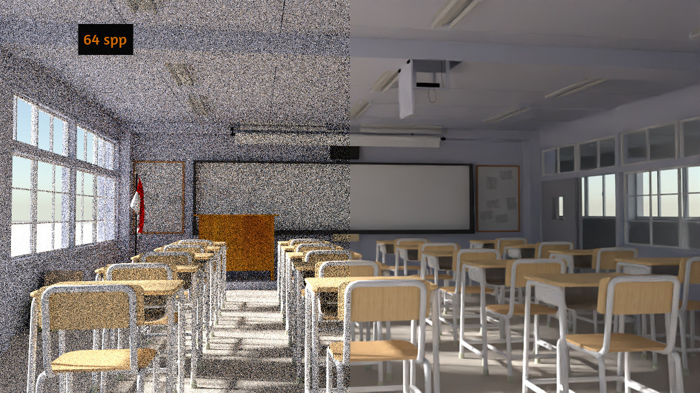
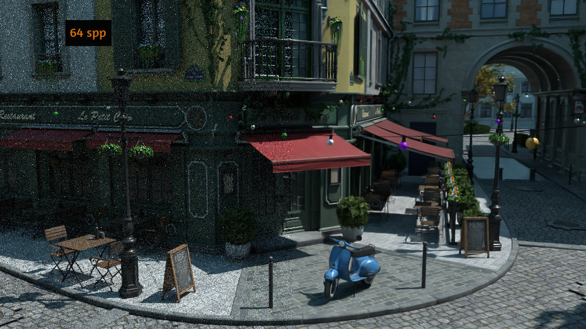
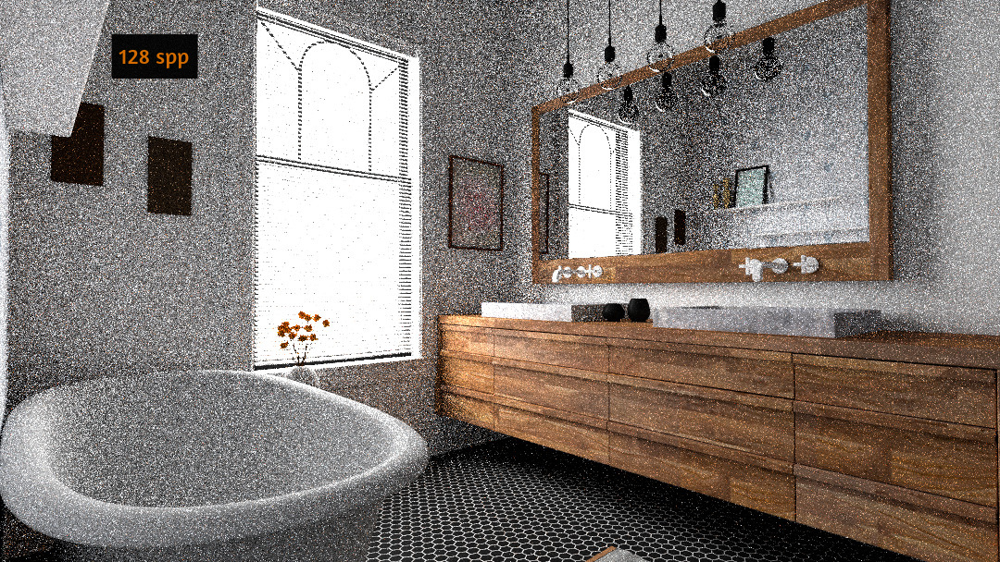
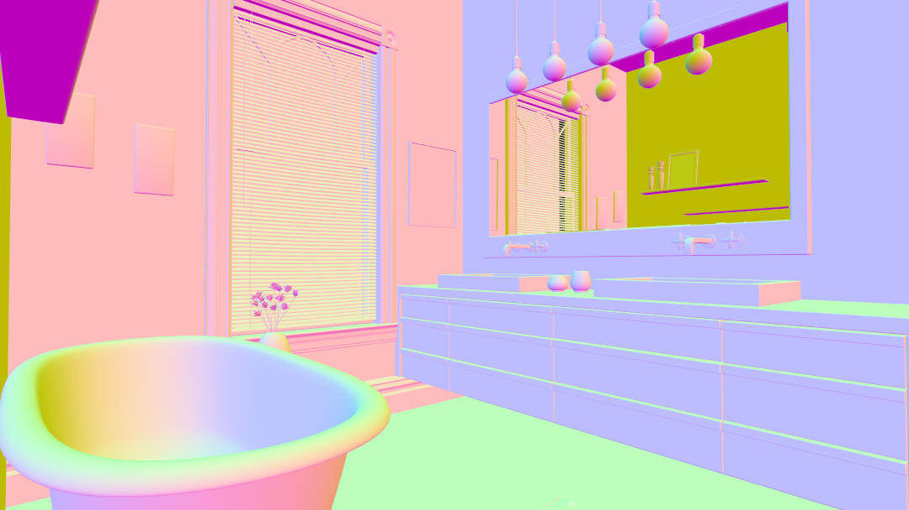
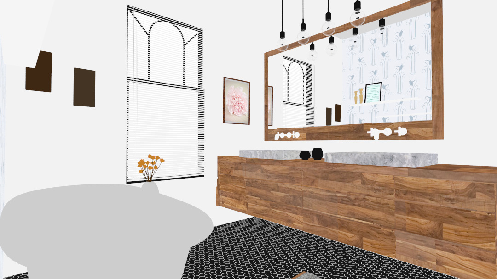
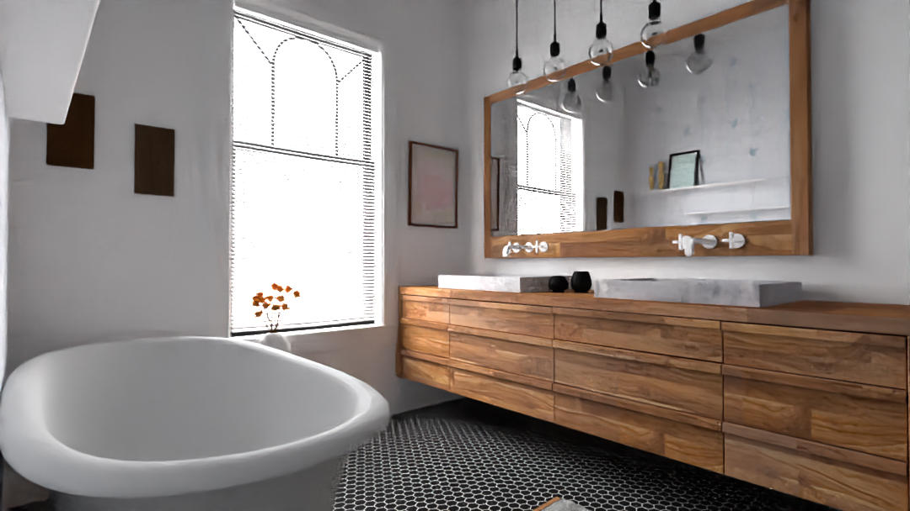

# Yocto AI Denoising
The main purpose of this project is to integrate and test the [Intel Open Image Denoiser](https://openimagedenoise.github.io) in Yocto. The `yimgdenoise` app uses the denoiser API to filter noisy images obtained through MC rendering. The parameters that can be passed from the command line to this app are:

- **--input-image**   input noisy image filename
- **--output-image**  output image filename
- **--normal**  normal image filename
- **--albedo**  albedo image filename 
- **--maxMemoryMB** approximate maximum amount of scratch memory to use in megabytes
- **--numThreads** maximum number of threads that can be used by the device
- **--verbose** device verbosity level
- **--setAffinity** bind software threads to hardware threads if set to true (improves performance); false disables binding

The results obtained with the intel denoiser are very convincing and show that this denoiser works well even with images generated using few ssp. The following images are some examples

## Feature images
The performance of the denoiser improves significantly by exploiting the two additional buffers containing the normal and the albedo for each pixel. This is particularly evident especially with objects that have a final look that depends on reflections and refractions. To calculate these images, two simple shaders have been added in `yocto_pathtrace.cpp`
- `trace_normal_denoiser()` normals of perfect metals are computed recursively following the reflected ray. For all other materials the normals are computed as usual at the first hit. The final values of the normals are left in the range [-1, 1] as required in the Intel denoiser documentation.
- `trace_albedo()` the albedo is computed as follows:
  - the albedo of emissive objects is just the emission term clamp to 1
  - for non delta surfaces it's the color of the material multiplied by the color texture
  - for delta surfaces the albedo is computed recursively follwing the ray sampled with the function `sample_delta()`

The following example shows the improvements achievable with the additional buffers. In particular, it can be seen that the details of the mirror in the scene are well reconstructed only with the use of the normal and albedo images. Another obvious benefit is that the textures are preserved very well.

### Input

### Normal

### Albedo

### Color only

### Color, albedo, normal buffers

## Non Local Means

## Test

